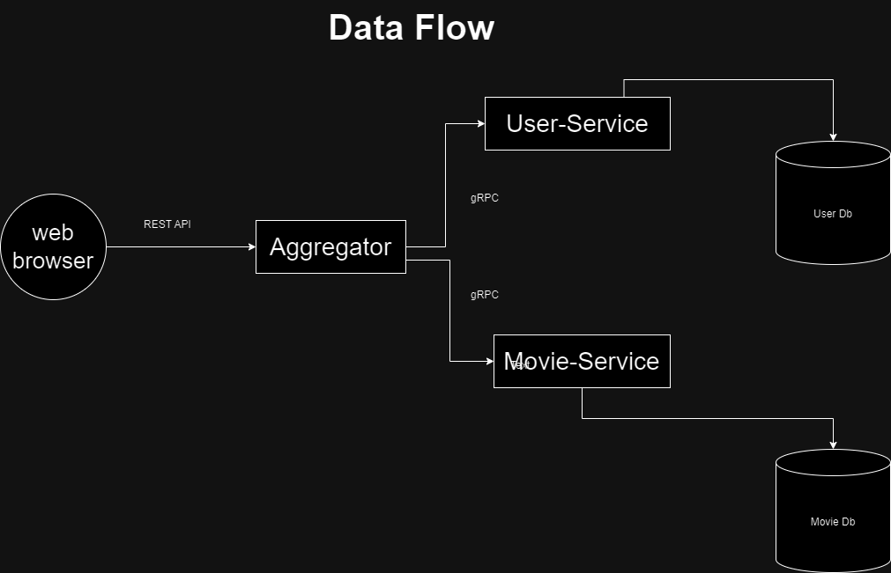

# 🎥🍿 Web Browser Aggregator Service 🌐🔍

This project is a simple representation of a system comprising a Web Browser, an Aggregator, a Movie Service, and a User Service. The Web Browser interacts with the Aggregator through REST API, while the Aggregator communicates with the User Service and Movie Service via gRPC.

## Data Flow Diagram

## How it Works 🛠️

1. **Web Browser Interaction**: 
   - The Web Browser communicates with the Aggregator using a REST API. It sends requests for movie data or user-related information.
   
2. **Aggregator Handling**: 
   - The Aggregator receives REST API requests from the Web Browser. It processes these requests and interacts with the User Service and Movie Service using gRPC.
   
3. **gRPC Communication**: 
   - The Aggregator communicates with the User Service and Movie Service using gRPC, exchanging necessary data and responses.

4. **MySQL Database**:
   - Both the Movie Service and User Service utilize MySQL databases for storing relevant data. 

## Setting Up 🚀

To set up this system locally, follow these steps:

1. Clone the repository.
2. Install dependencies using `npm install` or `yarn install`.
3. Ensure you have MySQL installed and configured with databases for Movie and User services.
4. Start the services by running `npm start` or `yarn start`.

## Contributing 🤝

Contributions are welcome! If you find any issues or have suggestions for improvements, feel free to open an issue or create a pull request.
